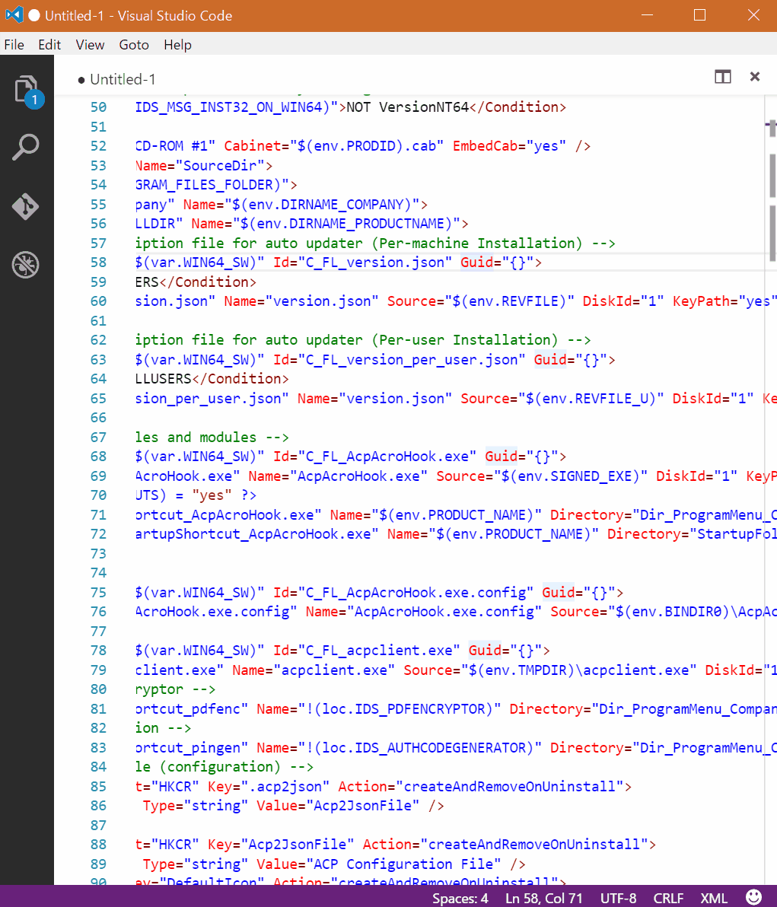

# genrandom - Generate Random Bytes

This is a Visual Studio Code extension, which generates random bytes and insert them on the current caret positions.

## Marketplace URL
https://marketplace.visualstudio.com/items?itemName=espresso3389.genrandom
